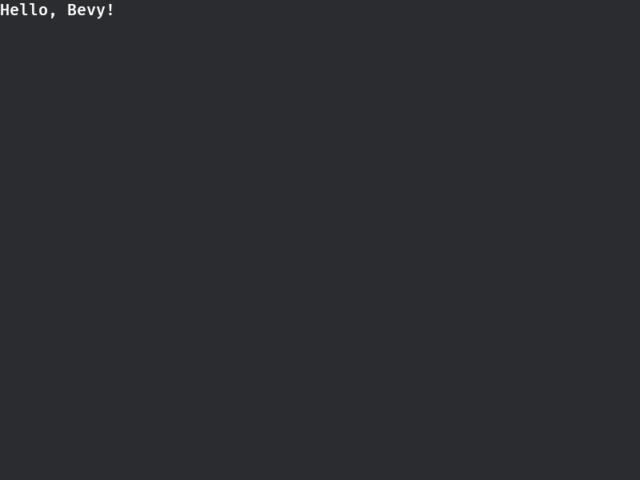

# 步骤零：搭建开发环境

## Rust 编程语言

[Bevy](https://bevy.org/) 游戏开发以 [Rust 编程语言](https://www.rust-lang.org/) 为主，本教程假设读者已经具有基本的 Rust 知识。
如果你对 Rust 尚不够了解，我们推荐你参考以下资料：

- [《Rust 编程语言》](https://kaisery.github.io/trpl-zh-cn/)：官方手册中文翻译，其中包含[安装](https://kaisery.github.io/trpl-zh-cn/ch01-01-installation.html)流程
- [《Rust 语言圣经》](https://course.rs/about-book.html)：专门为中文用户编写的教程
- [Awesome Rust](https://github.com/rust-unofficial/awesome-rust)：Rust 开源项目列表

## 系统依赖

- 对于 Windows 和 macOS 用户，系统自带图形和媒体环境，无需额外安装项目
- Linux 用户请参考[官方文档](https://github.com/bevyengine/bevy/blob/latest/docs/linux_dependencies.md)，根据自己的发行版安装系统库

## 创建项目

我们推荐你从头跟随项目创建步骤（对于已经较为熟悉的用户，TODO 模板）。

与其他 Rust 项目无异，Bevy 游戏项目同样使用 cargo 创建:

```sh
cargo new bevy-2048
cd bevy-2048
```

并在 `Cargo.toml` 中添加 `bevy` 作为依赖项：

```toml
# Cargo.toml
[package]
name = "bevy-2048"
version = "0.1.0"
edition = "2024"

[dependencies]
bevy = "0.16"
```

> [!NOTE]
>
> Linux 用户需要添加 wayland 特性以适应现代图形环境。
>
> ```toml
> bevy = { version = "0.16", features = ["wayland"] }
> ```
>
> 未来版本 bevy 将 wayland 设为默认，届时无需手动设置该选项，详情见 [PR #19232](https://github.com/bevyengine/bevy/pull/19232)。

## 初步上手

编程的第一步总是显示「hello, world」，在本步骤中，我们将实现类似功能。
显示效果如下：



### 子步骤一：应用入口

> [!TIPS]
> 完整源码见 [`step0_setup/src/bin/sub1_app.rs`](../../../step0_setup/src/bin/sub1_app.rs).
> 也可使用 `cargo run --package step0_setup --bin sub1_app` 直接运行。

在 `src/main.rs` 中写入以下代码：

```rust
// (I) import
use bevy::prelude::*;

fn main() {
    // (II) app entry
    App::new()
        // (III) default plugins
        .add_plugins(DefaultPlugins)
        .run();
}
```

然后命令行敲入 `cargo run` 即可启动。

> [!NOTE]
> Bevy 首次编译是全量编译，需要较长的时间。你可以趁此时间休息，或者也可以回顾游玩一下原版 [2048](play2048.co) 游戏。
>
> 后续增量编译耗时会大幅减少。在本文的后续部分，我们也会介绍进一步减少编译时间的办法。

在程序开始后，会弹出一个窗口如下图。由于目前我们尚未添加实际内容，因此窗口是空的。


在进一步编写内容之前，我们先来仔细剖析以上代码：

1. `use bevy::prelude::*;`: 导入 `bevy` 包预设命名空间。

2. `App::new().run()`: 创建 `App` 并运行。
   [`App`](https://docs.rs/bevy/latest/bevy/app/struct.App.html) 结构体是所有 Bevy 程序的入口，也负责储存程序所有的资源和运行逻辑。
   我们后续所有开发都会围绕 `App` 结构进行。

3. `app.add_plugins(DefaultPlugins)` 载入默认插件组（即内置功能）。
   Bevy 采用高度模块化的设计，即使是内建功能也采用插件的方式实现，方便用户深度修改。
   [`DefaultPlugins`](DefaultPlugins) 是默认插件组，适用于绝大多数游戏开发。
   用户可以在熟稔后再尝试 `MinimalPlugins` 等其他插件组（[`PluginGroup`](https://docs.rs/bevy/latest/bevy/prelude/trait.PluginGroup.html)）。

### 子步骤二：显示文本

> [!TIPS]
> 完整源码见 [`step0_setup/src/bin/sub2_hello.rs`](../../../step0_setup/src/bin/sub2_hello.rs).
> 也可使用 `cargo run --package step0_setup --bin sub2_hello` 直接运行。

创建应用完后，我们来进一步编写「hello, bevy」程序。
为了显示这一段文字，我们需要分别创建文本和相机。

- TODO: 这里是否给出整体代码再展示？
- TODO: 这里两个 system 是否合并？
- TODO: 结合 Camera2d 和 Text 介绍 ECS 以表格类比

```rust
// 文本组件
fn show_greet(mut commands: Commands) {
    commands.spawn(Text::new("Hello, Bevy!"));
}

// 相机组件
fn spawn_camera(mut commands: Commands) {
    commands.spawn(Camera2d);
}
```

TODO: 介绍两个组件

```rust
    App::new()
        .add_plugins(DefaultPlugins)
        .add_systems(Startup, spawn_greet_text)  // <- 添加文本系统
        .add_systems(Startup, spawn_camera)      // <- 添加相机系统。何为系统见下
        .run();
```

这里，系统 `system` 可以理解为程序逻辑。前面的 [`Startup`](https://docs.rs/bevy/latest/bevy/app/struct.Startup.html) 是该系统的生命周期阶段（[`ScheduleLabel`](https://docs.rs/bevy/latest/bevy/ecs/schedule/trait.ScheduleLabel.html)），即程序启动时。这两行意思是程序启动时生成问候文本和相机。

TODO: 是否要在此完整介绍生命周期？/ Update / 链接到 Tips

## 开发者体验

Rust 是高度优化的编译型语言。

// TODO:
